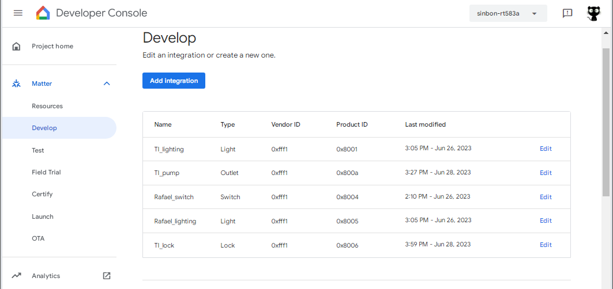
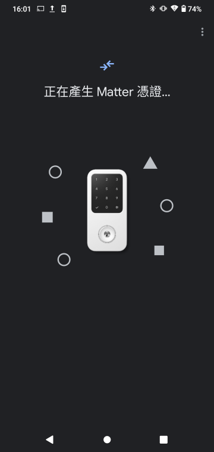
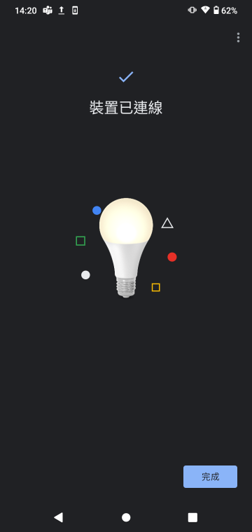
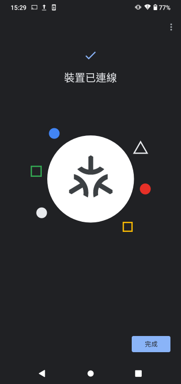

# CC2652R7_matter_example_hex
For Google home / Google nest hub gen 2 test

There are 3 hex file for test, lighting, lock, pump. 
You need to add you google account to google "Developer Console" and it is able to pass Matter check. 
 
   

The VID and PID is at https://github.com/TexasInstruments/matter/blob/v1.0-ti-branch/examples/xxx-app/cc13x2x7_26x2x7/args.gni  
All of VID is 0xFFF1. 
PID of lighting is 0x8001 
PID of lock is 0x8006 
PID of pump is 0x800A 
All of PIN is  34970112332 
 
All of QR-Code can get from UART log. 

The example of lock, press BTN-2 1 sec more to enable BLE advertising. 

 

 

 
 
# Useful reference
https://developers.home.google.com/matter/vendors/texas-instruments  
 
> ubuntu 20.04.6 <--- MUST, MUST, MUST, u22 is unable to compile  
>  
> sudo apt-get install git gcc g++ pkg-config libssl-dev libdbus-1-dev \  
>   libglib2.0-dev libavahi-client-dev ninja-build python3-venv python3-dev \  
>   python3-pip unzip libgirepository1.0-dev libcairo2-dev libreadline-dev  
>  
> download and run it  
> wget https://software-dl.ti.com/ccs/esd/sysconfig/sysconfig-1.15.0_2826-setup.run  
>  
>  
> git clone -b v1.0-ti-branch --recurse-submodules https://github.com/TexasInstruments/matter.git  
> cd matter  
> source ./scripts/activate.sh  
> cd ~/matter/examples/lighting-app/cc13x2x7_26x2x7  
> gn gen out/debug --args="ti_sysconfig_root=\"$HOME/ti/sysconfig_1.15.0\""  
> ninja -C out/debug  
>  
> I tried to build ok with pump-app/cc13x2x7_26x2x7, lighting-app/cc13x2x7_26x2x7, pump-app/cc13x2x7_26x2x7, lock-app/cc13x2x7_26x2x7.
> These hex can test with google nest hub gen 2.
 
If this document help you, how about buy street cats a can of fish ?

